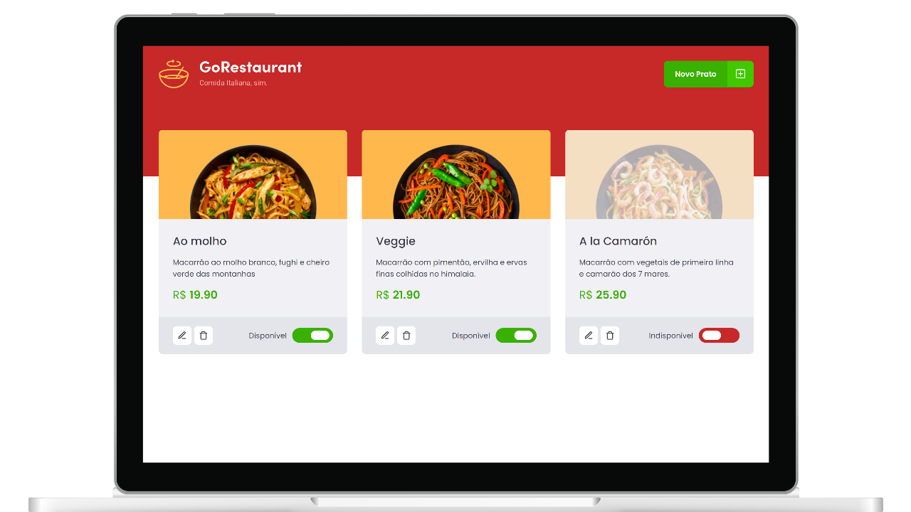

# GoRestaurant 🍕

**GoRestaurant** é um aplicativo web simples que permite ao usuário executar operações **CRUD** (Create, Read, Update e Delete) básicas em uma lista de pratos. O aplicativo e o design foram criados pela @Rocketseat e entregues como um desafio de módulo para no **Ignite Bootcamp**.



## ✨ Funcionalidades

- Visualizar uma lista de pratos disponíveis
- Criar um novo prato
- Editar um prato existente
- Excluir um prato
- Marcar um prato como disponível ou indisponível

## 👨‍💻 Desafio

- [x] Adicionar suporte completo e converter o projeto para utilizar Typescript
- [x] Refatorar todos os componentes de Classe para Funções

## 👀 Exemplo

```diff
import { Component } from "react";
import { FiPlusSquare } from "react-icons/fi";

import { Container } from "./styles";
import Logo from "../../assets/logo.svg";

+ interface HeaderProps {
+   openModal: () => void;
+ }

+ function Header({ openModal }: HeaderProps) {
- class Header extends Component {
-  render() {
-    const { openModal } = this.props;

    return (
      <Container>
        <header>
          
          <nav>
            <div>
              <button type="button" onClick={openModal}>
                <div className="text">Novo Prato</div>
                <div className="icon">
                  <FiPlusSquare size={24} />
                </div>
              </button>
            </div>
          </nav>
        </header>
      </Container>
    )
-  }
}

export default Header;
```

## 📦 Rodando o projeto

```bash
# Clone o repositório e instale as dependências
git clone https://github.com/mateusabelli/go-restaurant.git

cd go-restaurant

pnpm install
```

```bash
# Execute a aplicação (localhost:3000)
pnpm run start

# Execute a API json-server (localhost:3333/foods)
pnpm run server
```
